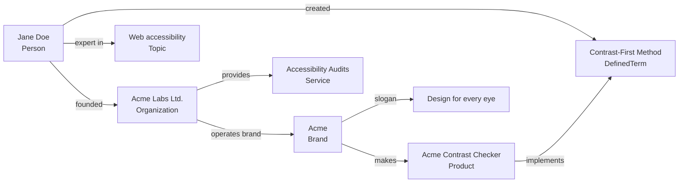

# Entity map — the foundation everything else reinforces

Entity SEO starts here, not with titles or schema. You can't help Google or an AI
engine understand how your entities relate until you've written those relationships
down yourself. Everything in the other reference files (schema, profiles, articles,
titles, images, video) exists to **reinforce the lines on this map**.

A test for whether this is done: for every line you draw between two entities, can
you say in one plain sentence *why* the line exists? If not, you don't understand
your own entities yet — and neither will a search engine.

## 1. Inventory the entities
List every distinct thing a searcher or an AI engine might need to identify. Each is
its own entity, even when names overlap:

| Entity type | Examples | Typical schema type |
|---|---|---|
| **Person** | the founder, the author, key team members | `Person` |
| **Brand** | the public-facing name customers know | `Brand` (or the `Organization` itself if brand = company) |
| **Legal company** | the registered name, if different from the brand | `Organization` / `Corporation` / `LocalBusiness` |
| **Products** | each thing you sell or ship (apps, tools, books, courses) | `Product`, `SoftwareApplication`, `Book`, `Course` |
| **Services** | each distinct service line | `Service` |
| **Ideas / methods / frameworks** | a named methodology, a coined term, a signature framework | `DefinedTerm` (in a `DefinedTermSet`), or `CreativeWork` |
| **Slogan / tagline** | the line you want associated with the brand | `slogan` property on the Brand/Organization |
| **Places** | HQ, service areas (only if real — see `local-voice-seo.md`) | `Place`, `PostalAddress` |
| **Topics you're known for** | the fields the entity should be associated with | `knowsAbout` values, `Thing` with `sameAs` to Wikipedia/Wikidata |

Rules:
- **Brand ≠ company ≠ person.** If the brand name differs from the legal name, that's
  two entities with a relationship between them, not one entity with two names.
- **Every product/service is an entity**, not just a bullet on a services page.
- **Only real entities.** Don't invent a "framework" just to have another node;
  the same guardrail as fake `sameAs` profiles applies.
- A solo individual with no company or products still has a map: Person → topics,
  Person → employer, Person → notable projects, Person → publications. Keep it
  small and true.

## 2. Draw the lines — the relationship table
Write every relationship as a row. The **Why** column is the important one: it's the
sentence your content will repeat and your schema will encode.

| From | Relationship | To | Why (one plain sentence) | Schema property |
|---|---|---|---|---|
| Jane Doe | founded | Acme Labs Ltd. | Jane started Acme Labs in 2019 to build accessible design tools. | `Organization.founder` / `Person.founderOf`* |
| Acme Labs Ltd. | operates the brand | Acme | Acme is the product brand of Acme Labs Ltd. | `Organization.brand` |
| Acme | makes | Acme Contrast Checker | Acme's flagship product checks WCAG color contrast. | `Product.brand`, `Product.manufacturer` |
| Acme Labs Ltd. | provides | Accessibility Audits | Acme Labs runs paid accessibility audits for SaaS teams. | `Service.provider`, `Organization.makesOffer` |
| Jane Doe | created | The Contrast-First Method | Jane coined the Contrast-First Method, which the Checker implements. | `DefinedTerm` + `CreativeWork.creator` |
| Acme | uses the slogan | "Design for every eye" | The slogan states Acme's accessibility-first position. | `Brand.slogan` |
| Jane Doe | is an expert in | web accessibility | Jane has 12 years of accessibility work and wrote the book on it. | `Person.knowsAbout` |

\* `founderOf` isn't a schema.org property — express founding from the
Organization side (`founder`) and link back from the Person with `worksFor`/
`affiliation` plus the shared `@id`.

Checklist for the table:
- Every entity in the inventory has **at least one line** to another entity.
  An orphan entity is one nobody can place.
- The person ↔ company ↔ brand ↔ product chain is **unbroken**. This is the chain
  most sites leave implicit and the one searchers and AI engines ask about most
  ("who makes X", "who founded Y", "what does Z sell").
- Relationships point **both ways** where a real-world source would state both
  (the company page lists the founder; the founder's profile lists the company).

## 3. Draw the graph
Render the table as a diagram so the entity (and anyone else on their team) can
see it. Mermaid works in GitHub/Markdown:

## 4. Give every entity a home
Each entity needs one canonical URL that is *about that entity* and serves as its
`@id` in schema:

- Person → `/about` (`{DOMAIN}/#person` or `{DOMAIN}/about#person`)
- Organization → homepage or `/company` (`{DOMAIN}/#org`)
- Brand → homepage if brand = site; otherwise a brand page (`{DOMAIN}/#brand`)
- Each product/service → its own page (`{DOMAIN}/products/{slug}#product`)
- Each method/idea → a page that defines it (`{DOMAIN}/method/{slug}#term`)

An entity whose only presence is a bullet on someone else's page is hard to
identify, hard to cite, and has nowhere to receive links. If a product or service
doesn't have a page yet, that's a Phase 4 content task.

## 5. Write the canonical relationship statements
Turn the **Why** column into a short **statement library**: the exact wording
reused (with natural variation) on every surface. This is how you get consistency
beyond just the brand name:

- **Person one-liner:** "Jane Doe is the founder of Acme Labs and creator of the
  Contrast-First Method for accessible design."
- **Company one-liner:** "Acme Labs Ltd., founded by Jane Doe in 2019, makes the
  Acme accessibility tools, including the Acme Contrast Checker."
- **Product one-liner:** "The Acme Contrast Checker, by Acme Labs, applies Jane
  Doe's Contrast-First Method to check WCAG color contrast."
- **Idea one-liner:** "The Contrast-First Method, created by Jane Doe, starts every
  design decision from color contrast."

Each one-liner names the entity **and at least one related entity**. That's the
difference from plain brand consistency: each one-liner confirms a line on the map
as well as the name.

Keep short (≈160 chars) and long (≈50 words) versions of each. Profiles, bios,
meta descriptions, and author boxes draw from this library (see
`references/reinforcement.md`).

## 6. Diagnose the current state against the map
For each row in the relationship table, check whether the world currently
confirms it:
- **On-site:** is the relationship stated in visible text *and* in the JSON-LD?
- **Off-site:** does at least one independent, trusted source state it (LinkedIn,
  Crunchbase, the company page, press, a product listing, a directory)?
- **Search/AI:** ask the relationship as a question ("who founded Acme Labs?",
  "who makes the Acme Contrast Checker?", "what is the Contrast-First Method?")
  in Google and 1–2 AI assistants. Record the answer.

Any row that fails is a work item. The fix is always one of: state it on-site,
encode it in schema, get it confirmed off-site, or publish content that
demonstrates it.

## Don't
- Don't claim relationships that aren't true (a fake partnership, an award, an
  "as seen in"). Every line must survive a fact-check.
- Don't split one real entity into several to pad the graph, or merge two real
  ones (brand and company) because it's simpler.
- Don't treat the map as done forever. New products, a rebrand, or a role change
  means new or changed lines — update the map first, then everything downstream.
